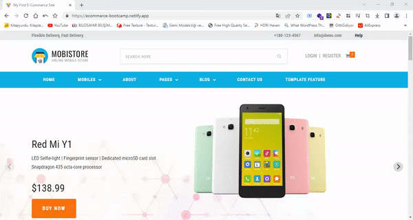

<h1># Alışveriş Sitesi Projesi</h1>

Bu proje, bir alışveriş sitesinin React formatına dönüştürülmesi ve çeşitli özelliklerin eklenmesi amacını taşımaktadır. Aşağıda projeyle ilgili detaylı bilgilere ulaşabilirsiniz.

<h1>## Hedefler</h1>

<h3>1. HTML Tasarımını React Formatına Dönüştürme:</h3>

- Verilen HTML tasarımını React bileşenleri ve JSX kullanarak dönüştürme işlemi gerçekleştirilecektir. 
- Tasarımın yapısı, bileşenlerin hiyerarşisi ve stillemesi React standartlarına uygun olacak şekilde düzenlenecektir. 

<h3>2. API'den Verileri Çekme:</h3>

- Gerekli olan verileri almak için bir API entegrasyonu yapılacaktır. 
- API, alışveriş sitesi için ürünler, kategoriler, sayfalar, kullanıcı bilgileri vb. gibi verileri sağlayacaktır. 
- Axios veya fetch gibi uygun bir kütüphane kullanılarak API istekleri gerçekleştirilecektir. 

<h3>3. Login ve Register Ekranları:</h3>
   - Kullanıcıların sisteme giriş yapabilmesi ve yeni hesap oluşturabilmesi için Login ve Register ekranları tasarlanacaktır. 
   - Kullanıcılar, formları doldurarak giriş yapabilecek veya yeni hesap oluşturabilecektir. 
   - Giriş ve kayıt işlemleri için API'ye gerekli veriler gönderilecek ve gelen yanıtlara göre işlem sonuçları alınacaktır. 
   - Kullanıcı bilgileri, giriş yaptıktan sonra tutulacak ve ilgili sayfalarda kullanılacaktır. 

<h2>Login Sayfasının Tasarımı:</h2>

HTML ve CSS kullanarak bir login formu oluşturulmuştur. 
E-posta adresi ve şifre gibi gerekli giriş alanları bulunmaktadır. 
Form göndermek için bir submit düğmesi de mevcuttur. 

<h3>onSubmit İşlevi:</h3>

Login sayfasındaki form, onSubmit olayı ile bir işlevle ilişkilendirilmiştir. 
Bu işlev, form gönderildiğinde çağrılacak olan asenkron bir işlevdir. 
İşlevin içinde, form verileri alınır ve bir JSON nesnesine dönüştürülür. 
Daha sonra, api.post fonksiyonu kullanılarak bu JSON verisi API'ye gönderilir. 
API'den gelen yanıt, authResponse değişkenine atanır ve konsola yazdırılır. 

<h3>API İstekleri:</h3>

API istekleri yapmak için bir api değişkeni kullanılmaktadır. Bu değişken, useApi kancasından elde edilen bir axios instance'ıdır. 
api.post fonksiyonu, bir POST isteği yapmak için kullanılır. 
İlk parametre olarak isteğin yapılacağı URL ("admin/authentication-token") verilir. 
İkinci parametre olarak form verilerini içeren bir JSON nesnesi (formJson) verilir. 
api.post fonksiyonu, isteğin tamamlanmasını bekler ve sonucu authResponse değişkenine atar. 

<h3>Sonuçları İşleme:</h3>

API isteği tamamlandıktan sonra, authResponse değişkeninde yanıt bilgileri bulunur. 
Bu yanıt, başarılı giriş durumunda bir kullanıcı kimlik bilgisi veya hata mesajları içerebilir. 
Login sayfasında, gelen yanıta göre işlem sonuçları uygun şekilde işlenir. Örneğin, başarılı giriş durumunda kullanıcı yönlendirilir veya hata mesajı görüntülenir. 
Register sayfası için de benzer bir işleyiş geçerlidir. Kullanıcılar register sayfasında gerekli bilgileri doldurduktan sonra form gönderildiğinde, API'ye bir POST isteği yapılır ve kullanıcı bilgileri kaydedilir. 

<h3>4. Kategori ve Ürünleri API'den Çekme:</h3>
   - Alışveriş sitesindeki kategoriler ve ürünler API'den çekilerek sayfalarda görüntülenecektir. 
   - Kategoriler, menülerde veya filtreleme seçeneklerinde kullanılabilecektir. 
   - Ürünler, ilgili kategorilere göre gruplandırılarak listelenecektir. 
   - Ürün detaylarına ve ilgili sayfalara yönlendirmeler yapılacaktır. 

<h1>## Kurulum</h1>

1. Projeyi klonlayın: `git clone https://github.com/kullanici/alisveris-sitesi.git` 
2. Proje dizinine gidin: `cd alisveris-sitesi` 
3. Gerekli bağımlılıkları yükleyin: `npm install` veya `yarn install` 
4. Projeyi başlatın: `npm start` veya `yarn start` 
5. Tarayıcınızda proje adresini açın: `http://localhost:3000` 

<h1>## Kullanım</h1>

- Ana sayfada alışveriş sitesinin React formatına dönüştürülmüş hali görüntülenecektir. 
- Kategoriler, ürünler, sayfalar vb. veriler API'den çekilerek dinamik olarak görüntülenecektir. 
- Login ve Register ekranlarına erişmek için ilgili bağlantılara tıklayabilirsiniz. 
- Ürün detaylarına ve il

<a href="https://ecommerce-bootcamp.netlify.app/">Canlı Önizleme</a>

